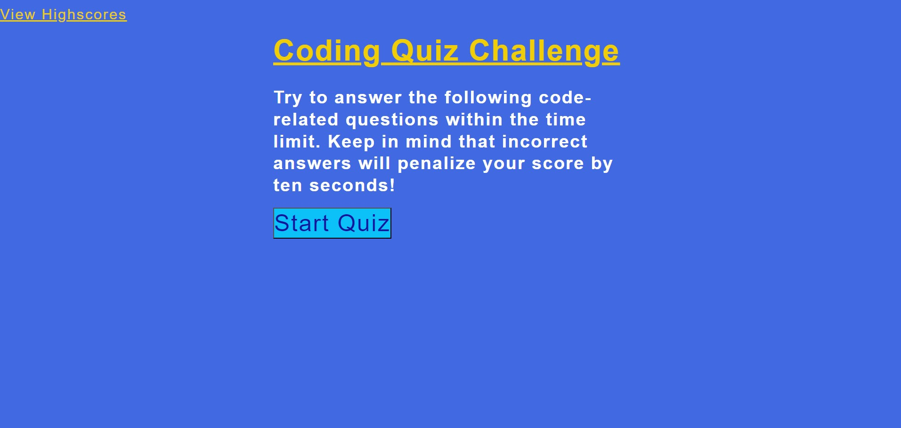
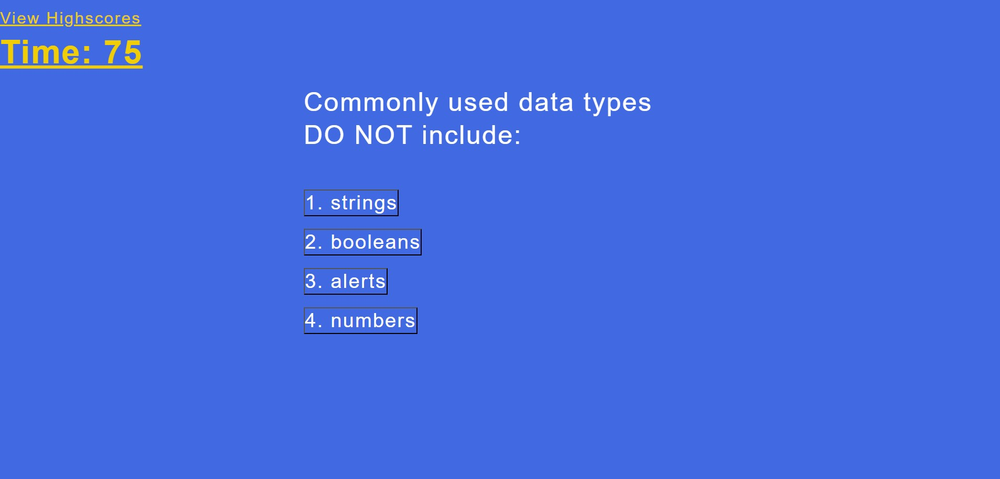
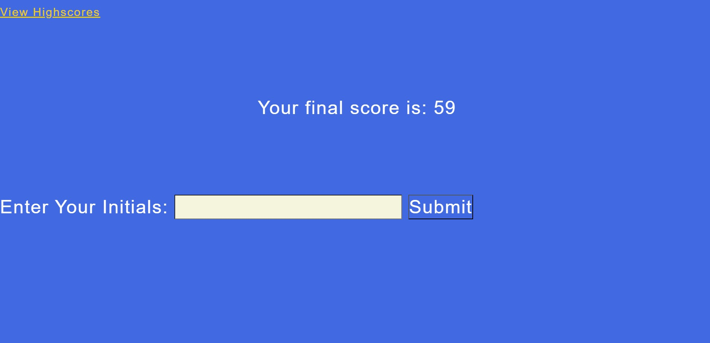

# Coding Quiz

## Description

This repo contains a timed multiple choice coding quiz app written in JavaScript.  

## Deployed Link

https://kyle188.github.io/multiple-choice-coding-quiz/

## Installation  

* Clone repository or download
* Open html in your browser

## Usage

*  Click Start buttomn to begin quiz

* Test your knowledge by clicking the correct answer, but choose quickly because this quiz is timed

* Enter your initials at the end and click Submit to save your Highscore

## Technologies Used

* JavaScript
* HTML
* CSS

## License

MIT